# Deccan Queen on Rails Tickets

Self-hosted conference ticketing for Deccan Queen on Rails 2026 — Razorpay payments, GST invoices, QR check-in.

[](https://github.com/saeloun/dqor-tickets/actions/workflows/ci.yml)

This app exists so an event can sell through its own Razorpay account, avoid per-ticket platform fees, issue its own GST invoices, and retain full control of attendee and payment data. It is also a reusable, single-event Rails ticketing reference rather than a multi-event SaaS platform.

## Features

- Separate orders and tickets: one buyer order can contain multiple attendee tickets with snapshotted prices and details.
- Ticket tiers with capacities, sale windows, per-order limits, and live per-tier availability.
- Inventory reserved by paid orders and unexpired pending orders; pending holds expire automatically after 30 minutes.
- Razorpay Orders API and Checkout, with test/live mode recorded in the payment audit log.
- Webhook-authoritative payment confirmation with raw-body signature verification, event-ID deduplication, idempotent confirmation, a browser-callback fallback, and a recurring reconciliation sweep.
- Percent or flat coupons with validity windows, usage limits, and optional ticket-type scope. Totals below Razorpay's ₹1 minimum follow the immediate complimentary/giveaway path.
- GST-inclusive tax invoices using SAC 998596, CGST/SGST for Maharashtra or IGST for interstate sales, Indian financial-year sequences, immutable invoice snapshots, and credit notes for refunds.
- Branded PDFs rendered from HTML/CSS by Ferrum and Chromium: an A5 heritage railway ticket with a QR code and an A4 GST invoice.
- Confirmation email with the invoice and each ticket attached; generated PDFs are archived through Active Storage in Cloudflare R2.
- Avo admin resources plus refund, complimentary-ticket, resend-confirmation, and orders/attendees CSV actions; the sales dashboard shows gross/net revenue, ticket-type capacity, and recent orders.
- Mobile admin QR check-in and attendee search at `/checkin`, with canceled-ticket handling and per-event-day duplicate guards.
- Sentry error tracking in production, with sensitive request fields filtered.
- Hourly WAL-safe SQLite backups to R2 with seven-day retention.

## Tech stack

- Ruby 4.0.6 and Rails 8.1
- SQLite for the app and Solid Queue, Solid Cache, and Solid Cable
- Propshaft, importmap, Turbo, and Stimulus; no Node build
- Ferrum and Chromium for PDFs; Prawn is not used
- Active Storage backed by Cloudflare R2
- `razorpay`, Avo, RQRCode, and Sentry
- RSpec, Capybara, and WebMock
- A CI-built Docker image published to GHCR and pulled by Render
- Cloudflare for DNS, R2 object storage, and SMTP email delivery

## Architecture

`Orders::Checkout` creates an `Order` and its `Ticket` records in one immediate SQLite transaction. Paid and unexpired pending orders reserve inventory. Razorpay handles the browser checkout, but only a verified and deduplicated webhook (or the reconciliation fallback) confirms payment. Confirmation issues the invoice before the delivery job renders and stores the PDFs, then queues the email.

```mermaid
flowchart LR
    A[Storefront] --> B[Orders::Checkout]
    B --> C[Pending Order + Tickets]
    C --> D[Razorpay Order + Checkout]
    D --> E[Verified Razorpay webhook]
    E --> F[PaymentEvent deduplication]
    F --> G[ConfirmOrderJob]
    G --> H[Paid Order + Invoice]
    H --> I[DeliverOrderConfirmationJob]
    I --> J[Ferrum PDFs to R2]
    J --> K[Confirmation email with attachments]
    K --> L[Paid confirmation page]
```



Orders totaling less than ₹1 skip Razorpay, complete through the same paid-order path, and enqueue delivery directly.

## Local development

### Prerequisites

- [mise](https://mise.jdx.dev/) with Ruby 4.0.6 (`mise install` reads `mise.toml`)
- Chromium, required when generating invoice and ticket PDFs
- SQLite development libraries

### Setup

```sh
mise install
bundle install
cp .env.example .env
bin/rails db:prepare db:seed
bin/dev
```

`bin/dev` starts the Rails server directly. `bin/rails server` does the same.

Run the test suite and style checks with:

```sh
bundle exec rspec
bin/rubocop
```

## Configuration

Copy `.env.example` to `.env` for development. Never commit real credentials.

### Razorpay

| Variable | Purpose |
| --- | --- |
| `RAZORPAY_KEY_ID` | Razorpay test or live key ID used by Orders API and Checkout. |
| `RAZORPAY_KEY_SECRET` | Secret used for Razorpay API access and browser callback verification. |
| `RAZORPAY_WEBHOOK_SECRET` | Separate secret used to verify webhook request bodies. |

### Cloudflare R2

| Variable | Purpose |
| --- | --- |
| `R2_ENDPOINT` | Account-specific S3-compatible R2 endpoint. |
| `R2_ACCESS_KEY_ID` | R2 API access key for Active Storage and backups. |
| `R2_SECRET_ACCESS_KEY` | R2 API secret key. |
| `R2_BUCKET` | Private bucket for PDFs and database backups. |

### SMTP and email

| Variable | Purpose |
| --- | --- |
| `SMTP_ADDRESS` | SMTP server hostname. The example uses Cloudflare's SMTP endpoint. |
| `SMTP_PORT` | SSL SMTP port; the example uses `465`. |
| `SMTP_USERNAME` | SMTP username or API token name. |
| `SMTP_PASSWORD` | SMTP password or sending API token. |
| `MAIL_FROM` | Sender address for ticket and credit-note email. |

### Seller and GST identity

| Variable | Purpose |
| --- | --- |
| `SELLER_NAME` | Supplier legal name printed on invoices. |
| `SELLER_GSTIN` | Supplier GSTIN printed on invoices. |
| `SELLER_ADDRESS` | Supplier address printed on invoices. |

### Admin

| Variable | Purpose |
| --- | --- |
| `ADMIN_EMAIL` | Email used to seed the first admin account. |
| `ADMIN_PASSWORD` | Password used when that admin account is first created. |

### Sentry

| Variable | Purpose |
| --- | --- |
| `SENTRY_DSN` | Enables Sentry error reporting in production when present. |

## Deployment

Pushes to `main` run two workflows:

- `ci.yml` runs Brakeman, Bundler Audit, importmap audit, RuboCop, and RSpec.
- `docker-build.yml` builds the Linux/AMD64 image, publishes `ghcr.io/saeloun/dqor-tickets:latest` plus a commit-SHA tag, then asks Render to deploy that image when the `RENDER_API_KEY` and `RENDER_SERVICE_ID` GitHub secrets are configured.

`render.yaml` defines one Singapore-region Render web service with `/up` health checks and a 1 GB persistent disk mounted at `/rails/storage`. Puma listens on `$PORT`; Solid Queue runs inside Puma, so no separate worker service is required. The persistent disk holds the primary, cache, queue, and cable SQLite databases.

Create the Render service from the blueprint, then set its unsynced environment variables:

- `RAILS_MASTER_KEY`
- `RAZORPAY_KEY_ID`, `RAZORPAY_KEY_SECRET`, `RAZORPAY_WEBHOOK_SECRET`
- `R2_ENDPOINT`, `R2_ACCESS_KEY_ID`, `R2_SECRET_ACCESS_KEY`, `R2_BUCKET`
- `SMTP_ADDRESS`, `SMTP_PORT`, `SMTP_USERNAME`, `SMTP_PASSWORD`, `MAIL_FROM`
- `SELLER_NAME`, `SELLER_GSTIN`, `SELLER_ADDRESS`
- `ADMIN_EMAIL`, `ADMIN_PASSWORD`

The blueprint also sets `APP_HOST=tickets.deccanqueenonrails.com`, `WEB_CONCURRENCY=1`, and `RAILS_MAX_THREADS=5`. Add `SENTRY_DSN` to enable Sentry. Point the public hostname to Render through Cloudflare DNS and configure the matching sender domain for email.

## Backups

In production, Solid Queue runs `BackupDatabaseJob` at the start of every hour. The job creates an online SQLite snapshot with `VACUUM INTO`, gzips it, uploads it as `db-backups/YYYY/MM/DD/HHMM.sqlite3.gz` in R2, and removes backups older than seven days. If R2 is not configured, it logs a warning and skips the run.

Create a backup immediately:

```sh
bin/rails db:backup
```

Restore an object to a separate verification database:

```sh
bin/rails 'db:backup:restore[db-backups/2026/07/19/1200.sqlite3.gz]'
sqlite3 storage/restored.sqlite3 'PRAGMA integrity_check;'
```

Restore never overwrites the live database. Stop the app and replace `storage/production.sqlite3` manually only after the integrity check succeeds and you have preserved the current database.

## Razorpay and GST notes

Use `rzp_test_...` credentials while developing and validating the full checkout flow. Switch all three Razorpay values to the live account before sales open. In the Razorpay dashboard, configure the app's `/webhooks/razorpay` endpoint and subscribe to `order.paid` or `payment.captured`, `payment.failed`, and `refund.processed`; use the same webhook secret as `RAZORPAY_WEBHOOK_SECRET`.

The app treats prices as GST-inclusive and currently uses SAC 998596 and Maharashtra supplier state code 27. Verify the SAC code, GST rate, buyer place-of-supply rules, invoice wording, and credit-note treatment with your chartered accountant before accepting live payments.

## Admin

Run `bin/rails db:seed` with `ADMIN_EMAIL` and `ADMIN_PASSWORD` set to create the first admin. There is no public admin signup route.

- `/avo` opens the authenticated administration area and sales dashboard.
- `/checkin` opens the authenticated mobile QR scanner and attendee search.

Change the initial password after deployment through the built-in password reset flow.

## Contributing

Bug reports and focused pull requests are welcome. Keep the app single-event and dependency-light, add or update RSpec coverage for behavior changes, and run `bundle exec rspec` and `bin/rubocop` before opening a pull request.

## License

This project is available under the [MIT License](LICENSE).
