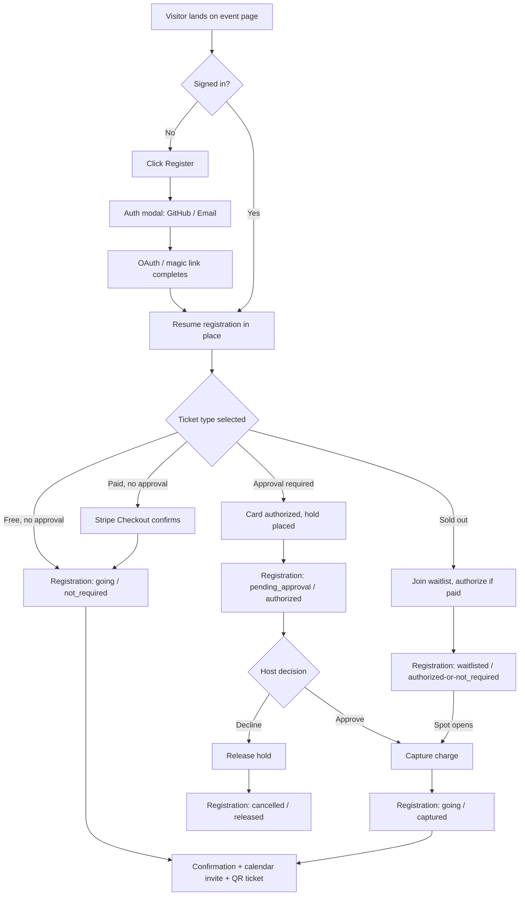

# Competitor UX Research: Luma, Townscript, Eventbrite, Meetup
### Design direction for a Luma-styled, Rails + Hotwire open-source events clone

Research date: 2026-07-29. Sources are cited inline; anything not directly sourced is marked as inference from general product familiarity and should be spot-checked against a live Luma account before implementation.

---

## 1. Feature matrix

| Capability | **Luma** | **Townscript** | **Eventbrite** | **Meetup** |
|---|---|---|---|---|
| **Event page design** | Single-page, single-column, highly visual; 40+ visual "themes" (Confetti, Polaroid, Champagne, Emoji, etc.), custom fonts/colors per event page [[help.luma.com]](https://help.luma.com/p/event-themes-and-customization) | Functional, template-driven registration page; less visual customization, form-first | Structured, brand-consistent template; organizer logo/banner but less per-event visual theming | Group-branded page; event nested inside a Group's identity, ads shown to non-paying guests [[help.luma.com]](https://help.luma.com/p/luma-vs-meetup) |
| **Registration / RSVP flow** | One-click "Register" → status (Going/Waitlist/Pending Approval); payment separated from RSVP intent [[help.luma.com]](https://help.luma.com/p/event-registration-process) | Multi-field registration form → checkout; can require full form before ticket selection | Ticket selector first → checkout (cart-based, can bundle multiple events) | RSVP tied to Group membership — RSVPing auto-joins the host Group [[help.meetup.com]](https://help.meetup.com/hc/en-us/articles/39235072484109-Finding-an-event) |
| **Ticket tiers** | Multiple types per event: free, paid, sliding-scale, "Require Approval" [[help.luma.com]](https://help.luma.com/p/setting-up-ticket-types) | Early-bird / VIP / Economy tiers, group & code-based discounts [[townscript.com]](https://www.townscript.com/organize/sell-your-event-tickets-online) | Tiered pricing, seat maps / reserved seating for venues [[help.luma.com]](https://help.luma.com/p/luma-vs-eventbrite) | Ticketing added Oct 2023, secondary to free RSVP model [[help.luma.com]](https://help.luma.com/p/luma-vs-meetup) |
| **Guest list / "who's going"** | Public, toggleable "Guest List" showing avatars for social proof; host can add avatar+name on behalf of guests not yet on Luma [[help.luma.com]](https://help.luma.com/p/event-guest-list) [[help.luma.com]](https://help.luma.com/p/inviting-and-adding-guests-to-your-event) | Attendee list is host-facing only (searchable, filterable by status/ticket type), not a public social-proof widget [[townscript.com]](https://www.townscript.com/organize/attendee-management-software) | Attendee list is private by default (host/organizer-only export) | Public attendee list per event ("Manage → Attendees"); full profile visibility gated behind Meetup+ [[help.meetup.com]](https://help.meetup.com/hc/en-us/articles/9389668230541-Manage-attendees-and-track-attendance-for-your-Meetup-event-on-the-web) |
| **Host tools** | Hosts/Managers roles, Calendar-level admins, Blasts (email+SMS+push), Insights (page views, referrers, top cities), Guest CRM, API/webhooks on paid tier [[help.luma.com]](https://help.luma.com/p/adding-hosts-and-managers-to-your-event) [[help.luma.com]](https://help.luma.com/p/sending-or-scheduling-event-blasts) | Registration forms, discount codes, real-time analytics dashboard, direct payouts | Organizer app (mobile), marketing/ad tools, integrations, up to 10k emails/day | Pro Network admin tools: multi-group dashboards, member CRM-lite, cross-group messaging [[help.meetup.com]](https://help.meetup.com/hc/en-us/articles/360002877711-Meetup-Pro-features-overview) |
| **Check-in** | Built-in QR scanner (app + web), dedicated "check-in staff" role with scoped access (scan/check-in/view guest list only) [[help.luma.com]](https://help.luma.com/p/adding-hosts-and-managers-to-your-event) | QR-based check-in via mobile Organiser app, real-time check-in reporting [[townscript.com]](https://www.townscript.com/organize/event-management-app) | Organizer app: QR scan + manual name lookup, real-time attendance dashboard [[eventbrite.com]](https://www.eventbrite.com/blog/onsite-operations-tools-eventbrite/) | No native check-in tooling [[help.luma.com]](https://help.luma.com/p/luma-vs-meetup) |
| **Reminders / follow-up emails** | Automatic reminders (1 day + 1 hour before), automatic post-event feedback email, customizable via Blasts [[help.luma.com]](https://help.luma.com/p/event-registration-process) | Automated confirmation/reminder emails, less granular scheduling | AI-assisted reminder emails, unlimited contacts, up to 10k sends/day [[eventbrite.com]](https://www.eventbrite.com/blog/event-reminder-email/) | Update/reminder blasts to RSVP'd members; more limited than Luma/Eventbrite |
| **Calendar integration** | Auto-adds to guest's calendar on RSVP (no manual "add to calendar" click needed); dedicated `.ics`/calendar invite in confirmation email [[help.luma.com]](https://help.luma.com/p/event-registration-process) | Standard add-to-calendar links on confirmation | Add-to-calendar links (Google/Outlook/ICS) on confirmation & reminder emails | Personal "Events Calendar" synced from RSVPs [[help.luma.com]](https://help.luma.com/p/luma-vs-meetup) |
| **Waitlists** | Native waitlist for free & paid tickets; for paid, card is authorized at waitlist-join and only captured on promotion to Going [[help.luma.com]](https://help.luma.com/p/waitlist) | Supported via capacity limits | Supported for sold-out events | Supported, prioritized for Meetup+ subscribers [[meetup.com]](https://www.meetup.com/blog/new-to-meetup-plus-october-2024/) |
| **Approval flows** | "Require Approval" toggle per ticket type; payment authorized (hold) at registration, captured only on host approval, released on decline [[help.luma.com]](https://help.luma.com/p/payment-require-approval) | Manual approval on custom forms (less native to checkout) | Available on some ticket types, less central to the flow | Group-join approval is the primary gate; per-event approval is secondary |
| **Communities / series** | **Calendars**: a durable, branded home for a recurring host/community — multiple admins, tag-based filtering, map view, "Follow" for newsletter digests, can pull in external/partner events as "curated" [[help.luma.com]](https://help.luma.com/p/luma-calendar-overview) | No first-class community layer — organizer account + individual events | **Organizer profile** page (all public events) + **Collections** (curated event groupings) + recurring-event series [[eventbrite.com]](https://www.eventbrite.com/help/en-us/articles/161196/how-to-set-up-your-organizer-profile-page/) | **Groups** are the core primitive — topic-based communities with member directories, discussion, and a Pro layer for multi-group networks [[help.meetup.com]](https://help.meetup.com/hc/en-us/articles/39428380107789-Meetup-Pro-Network-Administrators-Organizers-and-their-Members) |

**Positioning summary** (each platform's own words / market read):
- **Luma** — "modern, easy-to-use," fast/mobile-first, beautiful pages, built for speed over enterprise depth; best for tech meetups, startup events, creator-economy gatherings, community workshops. Funds settle to Stripe on a rolling basis (immediate-ish), vs. Eventbrite paying out post-event. 5% + Stripe fee, 0% on paid tier. [[help.luma.com]](https://help.luma.com/p/luma-vs-eventbrite)
- **Townscript** — self-serve, forms-and-checkout workhorse for India/APAC-heavy ticketing, wide currency support (138+), no strong design identity.
- **Eventbrite** — discovery marketplace + ad platform + enterprise ticketing (seat maps, box-office hardware); heavier and more "operations software" than "beautiful page."
- **Meetup** — community/group-first, not event-first; RSVP is a side effect of group membership; ad-supported free tier; least design-forward of the four.

---

## 2. Luma's design language, in detail

Luma is the reference for "beautifully designed" in this space, and the parts worth reverse-engineering are consistent across event pages, discover/calendar pages, and host tools: **restraint, generous whitespace, rounded geometry, and a content hierarchy that always puts the register action within reach.**

### 2.1 Layout system

- **Content-and-rail split on desktop.** The event page is conceptually two zones: a **scrolling content column** (cover image → title → host/date/location → description → FAQ) and a **register card** that behaves like a sticky/anchored sidebar once you cross a two-column breakpoint. On mobile everything collapses to one column and the register card becomes a bottom-fixed CTA bar or an inline card just under the fold. [[nicelydone.club]](https://nicelydone.club/apps/luma) [[luma.com]](https://luma.com/nucleatesummit2026)
- **Single primary CTA at all times.** Whatever the ticket complexity underneath, the page always surfaces one obvious button ("Get Tickets" / "Register") — tier selection happens *after* that click, inside a card/modal, not competing with it on the page.
- **Card-based composition.** Nearly every discrete unit (register box, "Hosted By," "Presented By," guest-avatar block, calendar entries) is its own rounded-corner card with its own padding, rather than a continuous form. This is what gives Luma pages their "collage of nice little boxes" feel rather than a monolithic form.
- **Icon-led metadata rows.** Date/time and location are each rendered as an icon + label row (small rounded-square icon tile on the left, two-line text on the right — e.g., a mini calendar-page icon showing the actual day/month, next to "Tuesday, August 18 · 6:00 PM"). This "icon tile that mirrors the data" pattern (a calendar icon that literally shows the date) is a signature Luma touch worth reproducing.
- **Discover/Calendar pages reuse the same card grammar**: event cards are compact image+title+meta tiles in a responsive grid; category browsing uses icon tiles; featured Calendars show small circular avatars with a "Follow" pill button — same visual language as the event page's host row. [[luma.com/discover]](https://luma.com/discover)

### 2.2 Typography

- Confirmed pattern (not independently font-verified — verify against a live inspect before hard-coding): a single **neutral, rounded/humanist sans-serif** stack used throughout, large confident event-title type (H1-scale, tight leading), and noticeably smaller, muted metadata text beneath it. Custom per-event fonts are offered as part of the 40+ theme system, but the *default* Luma-blue-and-white experience reads as system-native (SF Pro / Inter-class) rather than a display/editorial font. [[help.luma.com]](https://help.luma.com/p/event-themes-and-customization)
- For our clone: standardize on **Inter** (free, metrically similar to the SF/system feel Luma defaults to, ships well with Tailwind's `font-sans` stack) for UI chrome and body copy, and permit a small curated set of **display/theme fonts** per Calendar or event (this mirrors Luma's theming system) rather than per-organizer arbitrary font upload.
- Hierarchy to reproduce: **Title (28–36px, semibold, tight tracking) → Section labels (13–14px, uppercase or medium-weight, muted-gray, e.g. "HOSTED BY", "REGISTER") → Body (15–16px, relaxed line-height ~1.6) → Metadata (13–14px, muted).**

### 2.3 Color & neutrals

- Base surface is a **warm off-white / near-white**, not pure `#FFF` — gives the page a soft, paper-like feel rather than clinical SaaS white.
- Text uses **near-black, not true black** for body copy (standard for on-screen legibility — matches the practicaltypography.com guidance already in house: dark gray over pure black).
- Primary CTA is typically a **solid black (or very-dark-neutral) pill button** with white text — a deliberately low-saturation choice that lets *cover images* carry the color, not chrome. Luma's own brand palette (per third-party brand-color trackers) centers on a blue family alongside neutrals, used sparingly for links/accents/badges rather than backgrounds. [[mobbin.com/colors/brand/luma]](https://mobbin.com/colors/brand/luma) *(fetch blocked by auth wall — treat as directional, verify visually)*
- Borders are **hairline (1px, low-contrast gray)**, corners are **generously rounded (12–20px on cards, fully pill-shaped on buttons/badges/avatars)**, and shadows are **soft and shallow** (barely-there elevation, not drop-shadow-heavy skeuomorphism).
- Status colors are muted/pastel-backed pills rather than saturated alert colors: "Going" = soft green pill, "Waitlist" = soft amber/yellow pill, "Approval Pending" = soft neutral/blue pill — consistent with the overall "quiet, confident" palette rather than loud SaaS reds/greens.
- Per-event **theme system** (Confetti, Polaroid, Champagne, Emoji, etc.) swaps cover treatment, accent color, and sometimes font — this is the mechanism by which Luma stays visually fresh across very different event types without breaking the underlying grid. [[help.luma.com]](https://help.luma.com/p/event-themes-and-customization)

**Concrete token set to adopt for the clone** (directional starting point, tune against a real Luma page before shipping):

```
--surface-page:      #FAFAF9   /* warm off-white */
--surface-card:       #FFFFFF
--border-hairline:    #E7E5E4  /* stone-200-ish */
--text-primary:       #1C1917  /* near-black, not #000 */
--text-muted:         #78716C  /* stone-500-ish */
--cta-bg:             #18181B  /* near-black pill */
--cta-text:           #FFFFFF
--status-going-bg:    #DCFCE7  /* soft green */
--status-going-fg:    #166534
--status-waitlist-bg: #FEF3C7  /* soft amber */
--status-waitlist-fg: #92400E
--status-pending-bg:  #E0E7FF  /* soft indigo */
--status-pending-fg:  #3730A3
--radius-card:        16px
--radius-pill:        999px
```

### 2.4 Event page structure (top to bottom)

1. **Cover image** — full-bleed or inset rounded-rect image/video at the top; Luma supports animated covers and per-theme treatments.
2. **Calendar/Presented-by strip** — small circular avatar + Calendar name (e.g., "Presented by Nucleate Global Events Calendar") with a **Follow** pill button — this is the community/series hook, shown *above* the event title. [[luma.com/nucleatesummit2026]](https://luma.com/nucleatesummit2026)
3. **Title (H1)** — large, tight, event name only (no subtitle clutter).
4. **Metadata block** — stacked icon rows: date/time (with a literal mini-calendar icon showing the date), location (address withheld pre-registration for private/venue events, showing city/neighborhood only — "Register for exact address" pattern [[luma.com/nucleatesummit2026]](https://luma.com/nucleatesummit2026)).
5. **Register card** — the ticket/RSVP card: ticket-type list (name, price, "Requires Approval" badge, sales-window text), primary CTA button, and (once registered) swaps its own contents in place for a confirmation state — this is a natural Turbo Frame boundary.
6. **Hosted By** — host name(s) + avatar(s), social links, "Contact host" affordance; distinct from the "Presented by Calendar" strip at the top (Calendar = the recurring brand; Hosts = the individual people running *this* event). [[help.luma.com]](https://help.luma.com/p/adding-hosts-and-managers-to-your-event)
7. **Guest avatar stack / "X Going"** — overlapping circular avatars (white 2px ring between avatars for separation), truncated with a "+N" trailing chip past ~5–8 avatars, toggleable by the host. [[help.luma.com]](https://help.luma.com/p/event-guest-list)
8. **Description** — free-form rich text (headers, bullets, dividers) — the "About Event" body.
9. **Footer repeat** — host/calendar info again + Luma chrome (nav, share, report).

### 2.5 The calendar / discover view

- **Luma Calendar** is the community/series primitive: a branded, ownable page (own URL slug) with a **list or grid of upcoming events**, **tag-based filters**, a **map view** for geographically distributed events, and a **Follow** action that subscribes the visitor to a periodic digest email, segmentable by tag. [[help.luma.com]](https://help.luma.com/p/luma-calendar-overview)
- Multiple **admins** can be granted access to a Calendar without being individually added to every event under it — access is inherited top-down (Calendar admin ⊇ event host). [[help.luma.com]](https://help.luma.com/p/luma-calendar-overview)
- Calendars can **curate/embed events they don't own** (pull in a partner's event, displayed as "featured" but not manageable) — useful for community aggregators.
- The **Discover** page (luma.com/discover) is Luma's own multi-calendar marketplace: "Popular events near you," "Browse by category" (icon-tile grid with live counts), "Featured Calendars" (avatar + follow), and "Explore Local Events" by region/city. [[luma.com/discover]](https://luma.com/discover) This is the pattern to mirror for our clone's own homepage/discovery surface once multiple communities exist on the platform.

### 2.6 "Register" vs. "Buy Ticket" flow, and RSVP-before-pay

This is the most important mechanic to replicate faithfully, because it's *the* thing that makes Luma feel lightweight compared to Eventbrite's cart-and-checkout model.

- **Single CTA, deferred complexity.** The page shows one button. Its label is contextual — "Register" for free/RSVP events, "Get Tickets"/"Buy Tickets" when a paid tier exists — but clicking it always opens the **same card/modal**, which then reveals ticket-type choice (if >1 type), quantity, and registration questions. Payment fields only appear if the selected tier has a price > 0.
- **RSVP intent is captured immediately, independent of payment capture.** Luma's own "Require Approval" mechanism is the clearest evidence of this: on registering for an approval-gated *paid* ticket, **the card is authorized (a hold placed) but not charged**; the guest's status becomes "Pending"; only when the host approves does Luma **capture** the previously-authorized charge (or, if declined, the hold is released with no charge). [[help.luma.com]](https://help.luma.com/p/payment-require-approval) The same authorize-then-capture-or-release pattern applies to **paid waitlists**: joining authorizes payment; promotion to "Going" captures it. [[help.luma.com]](https://help.luma.com/p/waitlist)
- **This generalizes cleanly to a non-payment "attend" state.** Conceptually there are three orthogonal things Luma is tracking per guest, and our clone should model them as three separate concerns rather than one status enum:
  1. **Attendance intent** — has this person said "I'm coming"? (Not Going / Pending / Waitlisted / Going)
  2. **Payment state** — is money owed, and has it moved? (n/a for free / Authorized-not-captured / Captured / Refunded)
  3. **Access state** — can they get in? (derived: Going + (free OR captured) ⇒ valid ticket/QR issued)
- **Confirmation is instantaneous for the common case.** Free events / non-approval paid tickets go straight from click → confirmation screen → calendar auto-add + email, with no interstitial "please wait for approval" state at all. Approval and waitlist are opt-in frictions the host adds, not the default path.

### 2.7 The "who's going" avatar stack

- Rendered as a **horizontal row of overlapping circular avatars** (each with a subtle white/page-colored ring so they read as distinct discs even overlapping), ordered roughly by recency or host-curated priority (co-hosts/notable guests first), truncated at a small N (commonly ~5–8 visible) with a trailing **"+42"** style chip, and a text label like **"128 Going"** either beside or below the stack.
- It is explicitly a **social-proof primitive**, not a directory — Luma's own guidance frames it as building "social proof" and giving prospective attendees "an idea of who is going," not as a networking tool. [[help.luma.com]](https://help.luma.com/p/event-guest-list) (Section 5 below covers where a *real* networking layer — beyond social proof — could sit in our clone.)
- **Host-assigned avatars for offline guests**: if a host manually adds a guest who isn't on the platform yet, the host can set a placeholder name+avatar for them so the stack still looks populated/complete before that person ever signs in — worth replicating so early/manually-imported guest lists don't render as a wall of gray initials. [[help.luma.com]](https://help.luma.com/p/inviting-and-adding-guests-to-your-event)
- Visibility is **host-toggleable** at the event level (a single on/off switch on the manage page, not granular per-guest opt-out on Luma's side) — simplest possible privacy model. [[help.luma.com]](https://help.luma.com/p/event-guest-list)

### 2.8 Concrete UI patterns → Rails + Hotwire + Tailwind implementation notes

| Luma pattern | Rails/Hotwire/Tailwind approach |
|---|---|
| Register card that swaps to confirmation in place | `turbo_frame_tag "register_card"` wrapping the ticket-selector partial; the `RegistrationsController#create` response re-renders the same frame with a confirmation partial — no full page reload, no client JS state needed. |
| Ticket-tier picker modal/card | Stimulus `dialog` controller (or native `<dialog>`) toggling a Turbo Frame that lazy-loads `/events/:id/register` on first open, so unregistered visitors never pay the payload cost. |
| Overlapping avatar stack + "+N" | A single Tailwind-only `AvatarStackComponent` (ViewComponent): `flex -space-x-2` on an `<ul>` of ``, capped via `.first(n)` in Ruby, trailing `+N` as a same-sized circular `<li>`. No JS required — pure CSS overlap. |
| Icon tile that mirrors the actual date | `DateIconComponent` — a small rounded-square `<div>` rendering month abbreviation on top, day-of-month large below, driven by `event.starts_at.strftime`, not a static icon asset — matches Luma's "icon = data" trick cheaply. |
| Live guest count / "128 Going" updating as people RSVP | Turbo Streams broadcast from `Registration#after_create_commit` to a per-event stream (`turbo_stream_from event`), updating the count `<span>` and prepending the new avatar to the stack in real time — genuinely reproduces Luma's "feels alive" quality without a SPA. |
| Approval / waitlist status pill | A small `StatusBadgeComponent` mapping enum → Tailwind color-token pairs (see palette above); rendered both on the guest's own confirmation and in the host's guest-list table for consistency. |
| Blasts (host → guest email/SMS/push) | Background job (`Blasts::DeliverJob`) fanning out over `ActionMailer` (+ optional Twilio for SMS) filtered by guest status/ticket type; store as an audit-visible `Blast` record so hosts see send history, matching Luma's "schedule + audience filter" UI. |
| Calendar (community) page with tag filters + map | A `Calendar` model owning many `Event`s; `?tag=` scoped `where`, and a Stimulus-controlled map (Leaflet/MapLibre, self-hosted tiles to avoid a paid Google Maps key) plugged into a `data-controller="event-map"` div — keep the map fully progressive-enhancement (page works with the list alone if JS/tiles fail). |
| "Follow a Calendar" digest | `Follow` join model (user ↔ calendar) + a scheduled digest mailer (`CalendarDigestMailer`), segmentable by the same tags used for on-page filtering. |
| Per-event theme system | Store `theme` as an enum/string on `Event`, map to a small set of curated Tailwind class bundles (bg treatment + accent color + optional Google Font) applied via a `theme_classes` helper — avoid arbitrary user CSS injection (security + consistency). |

---

## 3. GitHub OAuth login + RSVP-before-buy flow

### 3.1 Why GitHub as primary OAuth for this clone

Luma itself does **not** offer GitHub OAuth — its sign-in options are email+code, phone (SMS/WhatsApp/Telegram), Google, Apple, passkeys, and enterprise SSO. [[help.luma.com]](https://help.luma.com/p/signing-in) [[help.luma.com]](https://help.luma.com/p/sso) That's the right menu for a consumer/party audience; it is **not** the right menu for a developer-tooling/OSS-community events clone, where GitHub is the dominant, already-trusted identity and doubles as a free, high-quality avatar + profile source. GitHub is the deliberate substitution point in this clone's design, not something we're claiming Luma does.

### 3.2 Proposed login UX

- **Entry point matches Luma's pattern exactly**: no dedicated "/login" wall gating browsing. Anyone can view any public event page and the Discover/Calendar pages unauthenticated. The **first auth prompt appears only when the visitor takes an action that requires identity** — clicking **Register** — mirroring Luma's low-friction "browse first, auth only to commit" flow.
- **Modal, not full-page redirect-away**, for the initial choice: a small centered card, "Sign in to register," with:
  1. **Continue with GitHub** (primary, full-width, GitHub mark + "Continue with GitHub") — sole first-class OAuth for v1.
  2. **Continue with email** (magic-link / one-time-code, no password) as the fallback for people without/unwilling to use GitHub — matches Luma's own "email code, no password required" pattern as the universal fallback. [[help.luma.com]](https://help.luma.com/p/signing-in)
- **OAuth scope**: request only `read:user` and `user:email` — no repo access, no write scopes. Nothing about an events RSVP tool needs GitHub write permissions; asking for more than identity+email is both a security smell and a conversion killer (the Council-of-Experts security review should flag any broader scope request).
- **Account linking by verified email**: if a GitHub-verified email matches an existing (email-code-created) account, link automatically rather than creating a duplicate identity — same behavior Luma documents for Google/Apple. [[help.luma.com]](https://help.luma.com/p/signing-in)
- **First-login profile prefill**: name, avatar (`avatar_url` from the GitHub API), and GitHub handle prefill the user's profile; user can override the display name/avatar afterward (some people don't want their GitHub headshot as their event-going avatar). Store the GitHub `id`/`login` for the "GitHub handle" badge concept in section 5, not just for login.
- **Post-auth return-to-action**: after OAuth completes, redirect straight back into the register flow the visitor was in (Turbo-friendly: stash the pending registration params in the session, resume the Turbo Frame render on return) — never dump the user on a generic dashboard after they clicked "Register" on a specific event.

### 3.3 RSVP-before-buy: attend/interested state distinct from a paid ticket

Data model (the key design decision):

```
Registration
  belongs_to :event
  belongs_to :user
  enum attendance_state: { interested: 0, going: 1, waitlisted: 2, pending_approval: 3, cancelled: 4 }
  enum payment_state:    { not_required: 0, authorized: 1, captured: 2, refunded: 3, released: 4 }
  ticket_type_id  # nullable — nil for a pure free RSVP with no tiers
```

- **`interested`** is the lightest-weight state — a single click, no payment intent created at all, no capacity consumed. This is the layer Luma doesn't have natively (its guest-list states start at "Invited/Pending/Going/Waitlist/Not Going") — worth adding for our clone as a genuine low-commitment "save this event" affordance, closer to Facebook Events' Interested/Going split, useful for the Discover/Calendar browsing surface (bookmark without committing) and as a lead signal for hosts ("47 interested, only 12 registered — push a reminder blast").
- **`going`** is created the moment someone completes free registration or a non-approval paid checkout — this is the RSVP-before-*money-moves* moment for the approval/waitlist paths:
  - Free event → `going` + `payment_state: not_required`, instantly.
  - Paid, no approval → `going` only *after* successful charge (standard checkout — no reason to defer here, Stripe Checkout/PaymentIntent confirms synchronously).
  - **Paid + Require Approval** → `pending_approval` + `payment_state: authorized` (Stripe `SetupIntent`/manual-capture `PaymentIntent`, hold placed, not charged) — the RSVP (their intent + card-on-file) is captured *before* the host has decided anything, exactly mirroring Luma's own documented mechanic. [[help.luma.com]](https://help.luma.com/p/payment-require-approval) Host approves → `going` + `payment_state: captured`. Host declines → `cancelled` + `payment_state: released`.
  - **Paid + Waitlist (capacity full)** → `waitlisted` + `payment_state: authorized`; promotion to a freed spot flips to `going` + `payment_state: captured`, same authorize/capture split as approval. [[help.luma.com]](https://help.luma.com/p/waitlist)
- **UI consequence**: the register card's primary button text and the guest's own status pill are driven off `attendance_state`, not off `payment_state` — a "Pending Approval" guest still shows up in the "who's going" *count* context appropriately (commonly excluded from the public avatar stack until confirmed `going`, to keep that surface trustworthy as social proof) while the *host's* guest-list table always shows both dimensions.



---

## 4. Gravatar-based attendee avatars

### 4.1 Fallback chain

Order of precedence per user, resolved at render time (cache the resolved URL, don't re-hash on every request):

1. **User-uploaded custom avatar** (if they set one explicitly in profile settings) — highest priority, always wins.
2. **OAuth-provider avatar** — GitHub's `avatar_url` for GitHub-authenticated users (already a CDN-hosted, decent-quality photo/avatar for the huge majority of devs).
3. **Gravatar**, keyed off the account's primary verified email — covers email/magic-link users with no GitHub avatar, and gives GitHub users a second option if they explicitly prefer their Gravatar identity.
4. **Gravatar identicon** — Gravatar's own deterministic geometric-pattern fallback when no Gravatar image is registered for that email hash; requested via the `d=identicon` default-image parameter so *something* branded-looking always renders instead of a broken image. [[docs.gravatar.com]](https://docs.gravatar.com/sdk/images/)
5. **Local generated fallback** (last resort, e.g. if Gravatar itself is unreachable) — initials-on-solid-color SVG, deterministic from user id so it's stable across renders.

### 4.2 Implementation sketch (Rails)

```ruby
# app/models/concerns/avatarable.rb
module Avatarable
  GRAVATAR_BASE = "https://www.gravatar.com/avatar/".freeze

  def avatar_url(size: 128)
    return custom_avatar_url if custom_avatar_url.present?
    return github_avatar_url if github_avatar_url.present?

    hash = Digest::SHA256.hexdigest(email.strip.downcase) # Gravatar's current API accepts SHA256; MD5 remains supported for legacy compatibility [docs.gravatar.com]
    "#{GRAVATAR_BASE}#{hash}?s=#{size}&d=identicon&r=pg"
  end
end
```

- Use `d=identicon` (or `robohash`/`retro` for a more playful clone-specific default — pick one house style and apply it everywhere, don't let it vary per view) plus `r=pg` rating cap. [[docs.gravatar.com]](https://docs.gravatar.com/sdk/images/)
- `f=y` (force default) is available if we ever want to *disable* real Gravatar photos platform-wide (e.g., a "no real photos" community norm) and always show identicons — worth exposing as a Calendar-level setting for communities that prefer pseudonymity, echoing Luma's per-Calendar customization philosophy.
- Cache resolved avatar URLs (`Rails.cache` keyed by `user_id + updated_at`) — Gravatar/GitHub are both external calls-in-effect (image `src`, not literally fetched server-side, but hashing + URL construction is cheap to memoize anyway) and this avoids recomputing the hash per avatar render in a guest list of hundreds.
- In the `AvatarStackComponent`, every `` needs `loading="lazy"` past the first ~8 visible avatars, and a `onerror`-safe path (Stimulus controller swapping to the initials-SVG fallback client-side) in case a stale Gravatar/GitHub URL 404s.

---

## 5. Attendee networking: sessions, agenda, "people you want to meet," connections

None of the four reference products do this deeply — Luma's guest-avatar stack is explicitly social-proof, not a matchmaking layer; dedicated matchmaking is the domain of conference-specific tools (Whova, Brella, Grip, Eventtia), where attendees declare networking goals and an algorithm (or manual meeting-request flow) surfaces relevant people and slots time for 1:1s. [[whova.com]](https://whova.com/blog/attendee-matchmaking-event-networking/) [[brella.io]](https://www.brella.io/event-matchmaking) [[grip.events]](https://www.grip.events/products/event-matchmaking) [[eventtia.com]](https://www.eventtia.com/en/virtual-networking-event-platform/)

That's the gap to fill deliberately in this clone, in a way that stays true to Luma's minimalism rather than importing a heavy enterprise-matchmaking UI. Proposed, staged:

**Stage 1 — Session selection / personal agenda** (for multi-session events, e.g. a conference/summit with tracks):
- Each `Session` belongs to an `Event`; attendees who are `going` can **bookmark sessions** into a `MyAgenda` (a simple join table, no algorithm).
- Surfaced as a **"My Schedule"** tab on the event page (Turbo Frame, only visible to `going` attendees), rendering their bookmarked sessions in time order with room/track badges — visually consistent with the event page's existing icon-tile date/time rows (section 2.4).
- Conflict detection (two bookmarked sessions overlap in time) shown as a small inline warning — cheap, high-value, no ML required.

**Stage 2 — Opt-in attendee directory + interest tags** (lightweight version of "who you want to meet"):
- On registration (or afterward in profile), attendee can optionally add **1–5 short interest/offer tags** ("hiring," "looking for co-founder," "Rails," "climate tech") — free-text-with-autocomplete against a per-Calendar tag vocabulary, not a rigid taxonomy.
- A **"People" tab** (opt-in, off by default — privacy-first, matching Luma's single host-level toggle philosophy from 2.7) lists `going` attendees who've opted into the directory, filterable by tag, each row = avatar + name + tags + a **"Connect"** button.
- No AI matchmaking in v1 — tag-filtering *is* the matchmaking, which is transparent, cheap to build, and defensible (no black-box "who you should meet" pressure, which is where enterprise tools like Grip/Brella get heavy).

**Stage 3 — Connections**:
- `Connection` model: `requester_id`, `recipient_id`, `event_id` (or nullable for platform-wide), `status: pending/accepted/declined`.
- "Connect" sends a request; **acceptance reveals contact info exchange** (email or a Luma-style masked-until-mutual-connection reveal — Luma itself keeps guest emails visible only to hosts by default, worth mirroring for peer-to-peer: don't expose raw emails on accept, offer an in-app message thread instead, or a mutual "reveal email" opt-in).
- Accepted connections persist **across events** if both are on the same Calendar (this is the piece that turns "one event's guest list" into an actual community graph over time — the natural extension of Luma's Calendar-as-durable-community concept from section 2.5).
- Post-event, an optional **"People you met" digest email** (session-attendance + directory-tag overlap as the *signal*, not an AI black box) nudging attendees to send connection requests to people they were near — this is the safe, transparent version of what Brella/Whova do with heavier machinery.

**IA placement**: keep this entirely inside the existing event-page IA (a tab set: **Overview / Schedule / People**) rather than a separate "networking app" — consistent with Luma's one-page-per-event philosophy; conference-scale events get the extra tabs, a simple meetup does not (tabs conditionally render only if the event has sessions and/or the host has enabled the directory).

---

## 6. Proposed attendee-facing IA / end-to-end flow

### 6.1 Sitemap

```
/                              → Discover (Luma-style: popular events, categories, featured calendars)
/discover?category=&city=      → Filtered discovery
/c/:calendar_slug               → Calendar (community) page — event list/grid, tag filter, map, Follow
/c/:calendar_slug/:event_slug   → Event page (the core unit)
    ?tab=overview  (default)   → hero, host, date/location, description, register card, guest avatar stack
    ?tab=schedule               → (multi-session events only) session list + "My Schedule"
    ?tab=people                 → (opt-in directory events only) attendee directory, tag filter, Connect
/events/:id/register            → Turbo Frame partial, not a full route in practice (modal/frame-driven)
/tickets/:id                    → Attendee's own ticket (QR code, add-to-wallet, cancel/transfer)
/me                              → "My Events" — Going / Interested / Past, personal calendar feed (ICS subscribe)
/me/connections                 → Accepted/pending connections across all events
/me/profile                      → Avatar (custom/GitHub/Gravatar), display name, interest tags, privacy toggles
/auth/github, /auth/callback     → OAuth
/login                           → Email magic-link fallback
```

### 6.2 End-to-end attendee flow (happy path, free event)

1. Visitor arrives at `/c/rubyconf/2026-summit` from a shared link (no auth wall).
2. Scrolls hero → host → date/location → reads description; sees "128 Going" avatar stack for social proof.
3. Clicks **Register** → Turbo Frame swaps in ticket-type card (single free tier) → clicks confirm.
4. Not signed in → auth modal → **Continue with GitHub** → OAuth round-trip → returns straight into the same frame, now showing confirmation.
5. Confirmation state in place: green "You're Going" pill, "Add to Calendar" (auto-fires an `.ics` download / calendar-invite email), QR ticket link, and — if the event has sessions — a prompt to "Build your schedule."
6. Attendee optionally visits **Schedule** tab, bookmarks 4 sessions into My Schedule.
7. Attendee optionally visits **People** tab, adds 2 interest tags, sends 3 Connect requests.
8. T-1 day and T-1 hour: automated reminder emails (mirroring Luma's cadence) with their schedule + any accepted connections attached.
9. Post-event: automated feedback-request email + (if directory enabled) "People you met" digest.
10. Their `/me` page now shows this event under "Past," with connections persisting into their cross-event connection list.

### 6.3 End-to-end flow (paid + approval-required, the harder case)

1–4 identical, except the register card shows a priced tier with a "Requires Approval" badge and sales-window text.
5. On confirm, Stripe collects card details and **authorizes** (holds) the charge — UI shows "Your registration is pending host approval; your card has been authorized but not charged" (explicit, no ambiguity — this is exactly the kind of moment that erodes trust if under-explained).
6. Attendee's own status pill: **"Pending Approval"** (soft-indigo token from section 2.3), not counted in the public "Going" avatar stack.
7. Host approves (from the manage-guest-list table) → webhook/job captures the charge → attendee status flips to **Going**, confirmation email fires, they now appear in the public avatar stack.
8. Host declines → hold released, no charge, attendee notified, status → Cancelled.

---

## Sources

- [Luma vs Eventbrite — Luma Help](https://help.luma.com/p/luma-vs-eventbrite)
- [Luma vs Meetup — Luma Help](https://help.luma.com/p/luma-vs-meetup)
- [Event Themes and Customization — Luma Help](https://help.luma.com/p/event-themes-and-customization)
- [Event Guest List — Luma Help](https://help.luma.com/p/event-guest-list)
- [Managing Your Guest List — Luma Help](https://help.luma.com/p/managing-your-guest-list)
- [Inviting and Adding Guests to Your Event — Luma Help](https://help.luma.com/p/inviting-and-adding-guests-to-your-event)
- [Adding Hosts and Managers to Your Event — Luma Help](https://help.luma.com/p/adding-hosts-and-managers-to-your-event)
- [Luma Calendar Overview — Luma Help](https://help.luma.com/p/luma-calendar-overview)
- [Event Registration Process — Luma Help](https://help.luma.com/p/event-registration-process)
- [Setting Up Ticket Types — Luma Help](https://help.luma.com/p/setting-up-ticket-types)
- [Payment + Require Approval — Luma Help](https://help.luma.com/p/payment-require-approval)
- [Waitlist — Luma Help](https://help.luma.com/p/waitlist)
- [Signing In to Luma — Luma Help](https://help.luma.com/p/signing-in)
- [Single Sign-On (SSO) — Luma Help](https://help.luma.com/p/sso)
- [Sending or Scheduling Event Blasts — Luma Help](https://help.luma.com/p/sending-or-scheduling-event-blasts)
- [Event Insights — Luma Help](https://help.luma.com/p/event-insights)
- [Luma Discover](https://luma.com/discover)
- [Nucleate Global Summit 2026 — sample Luma event page](https://luma.com/nucleatesummit2026)
- [Luma UI screen examples — NicelyDone](https://nicelydone.club/apps/luma)
- [Luma Event Details UI Design — SaaSFrame](https://www.saasframe.io/examples/luma-event-details)
- [Townscript — Online Event Registration and Ticketing Platform](https://www.townscript.com/organize/online-event-registration-and-ticketing-platform)
- [Townscript — Attendee Management Software](https://www.townscript.com/organize/attendee-management-software)
- [Townscript — Event Management App](https://www.townscript.com/organize/event-management-app)
- [Eventbrite — Event Reminder Emails](https://www.eventbrite.com/blog/event-reminder-email/)
- [Eventbrite — Onsite Operations Tools](https://www.eventbrite.com/blog/onsite-operations-tools-eventbrite/)
- [Eventbrite — Create and edit your organizer profile](https://www.eventbrite.com/help/en-us/articles/161196/how-to-set-up-your-organizer-profile-page/)
- [Eventbrite — Set up a recurring event](https://www.eventbrite.com/help/en-us/articles/193464/set-up-an-event-with-multiple-dates-without-an-event-schedule/)
- [Meetup — Finding an event](https://help.meetup.com/hc/en-us/articles/39235072484109-Finding-an-event)
- [Meetup — Manage attendees and track attendance](https://help.meetup.com/hc/en-us/articles/9389668230541-Manage-attendees-and-track-attendance-for-your-Meetup-event-on-the-web)
- [Meetup Pro features overview](https://help.meetup.com/hc/en-us/articles/360002877711-Meetup-Pro-features-overview)
- [Meetup Pro — Network Administrators, Organizers, and their Members](https://help.meetup.com/hc/en-us/articles/39428380107789-Meetup-Pro-Network-Administrators-Organizers-and-their-Members)
- [Gravatar — Avatars for Developers (image API, default images)](https://docs.gravatar.com/sdk/images/)
- [Whova — Attendee Matchmaking](https://whova.com/blog/attendee-matchmaking-event-networking/)
- [Brella — Event Matchmaking](https://www.brella.io/event-matchmaking)
- [Grip — AI Event Matchmaking & Networking Software](https://www.grip.events/products/event-matchmaking)
- [Eventtia — Virtual Networking Event Platform](https://www.eventtia.com/en/virtual-networking-event-platform/)

**Note on confidence**: The feature-matrix rows and Luma mechanic descriptions (approval/hold-capture, waitlist, guest list toggle, Calendar model, Blasts, sign-in methods) are sourced directly from Luma's own help center and are high-confidence. The visual/typographic specifics in section 2 (exact color hex values, font family) are reconstructed from product familiarity plus indirect sources (NicelyDone catalog, blocked-by-auth Mobbin color page) and are flagged as **directional — verify against a live logged-out Luma event page before locking in exact tokens for implementation.**
