# Web/mobile design audit — 2 October 2026

**Verdict:** The three event identities remain distinct and coherent. Organizer readability, target size, setup language and preview recovery needed refinement. This increment addresses the owned theme/editor findings. Foundation independently applied creation-flow feedback in [PR169](https://github.com/saeloun/dqor-tickets/pull/169), initially reviewed at `786ca0c`.

## Scope and evidence

Fresh local Chromium captures at 390×844 and 1440×1000, real Rails system tests with synthetic admins, plus current browser screenshots explicitly supplied by the foundation owner. No production accounts, live registration, deployment or private client assets. Theme captures show illustrative event content; persisted previews use existing DQOR identity. Foundation screenshots are read-only evidence from its synthetic system journey, not a claim that this branch contains that feature.

The in-app browser could not initialize because the configured writable workspace has a symlink component. Existing Playwright/Cuprite browser verification was used. All accepted screenshots below were opened and inspected.

## Journey review

1. **Choose an identity — healthy.** All three pages retain hierarchy, programme, visit and footer on desktop and phone. The same section vocabulary does not erase their different typography and palettes. Gallery pagination and keyboard/touch selection were already delivered in PR150.

| Identity | Phone | Desktop |
| --- | --- | --- |
| Gathering | [Full capture](audit-2026-10-02/theme-conference-mobile-review.png) | [Full capture](audit-2026-10-02/theme-conference-desktop-review.png) |
| Movement | [Full capture](audit-2026-10-02/theme-marathon-mobile-review.png) | [Full capture](audit-2026-10-02/theme-marathon-desktop-review.png) |
| Commons | [Full capture](audit-2026-10-02/theme-campus-mobile-review.png) | [Full capture](audit-2026-10-02/theme-campus-desktop-review.png) |

2. **Enter the editor — improved.** The Edit link measured 22×44px; header links were 10px text. They now have 48px targets; editable text is 16px, labels 14px. Supporting copy is shorter and numbered sections describe actions.

| Before | After |
| --- | --- |
| 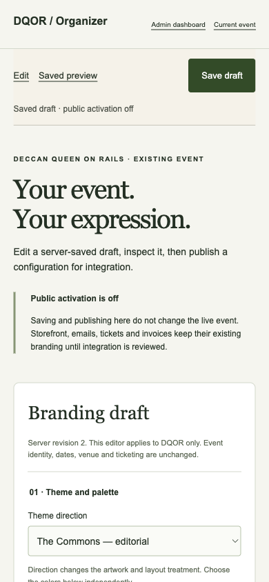 | 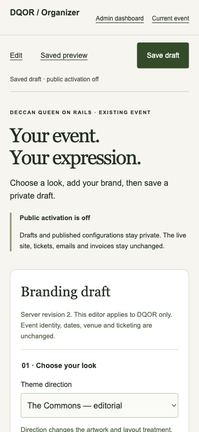 |
| 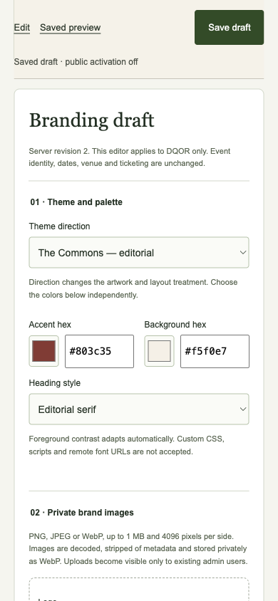 | 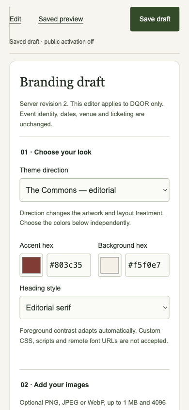 |

3. **Use keyboard focus — fixed.** The marathon CTA inherited black focus ink on a dark green page: **1.42:1**. Its ring now uses page foreground: **14.80:1**. Other links retain their contextual foreground so focus also works in colored visit sections. See [baseline focus](audit-2026-10-02/04-movement-focus-before.png). Default theme body/CTA contrast is at least 8:1; the configuration check samples 4,096 color choices at 4.5:1 or better.

4. **Add images and arrange — improved.** Empty slots explain the current theme mark/artwork and optional favicon. File previews and cancellation remain local until saving. Each section must appear once; invalid order retains entered values. Control boundaries use a stronger color than decorative card borders.

5. **Preview, recover, return — verified.** Real Rails browser tests pause the preview response, return HTTP503, then retry the working endpoint. Loading and retry are explicit; Back remains available, and the unsaved hex value survives. No client-side mock is used for the accepted screenshots. Frame scrolling cannot displace the return toolbar.

| Loading | Failed response | Recovered |
| --- | --- | --- |
| 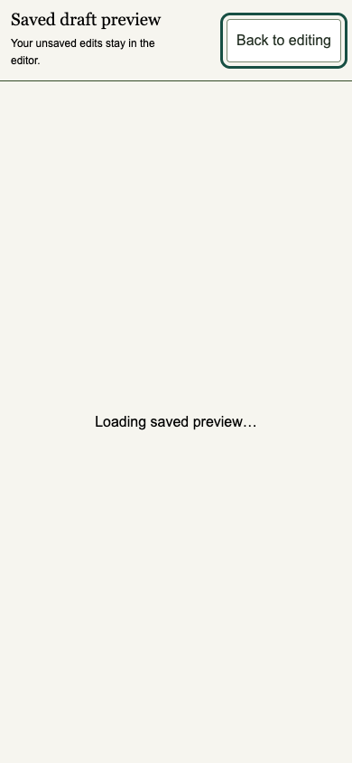 | 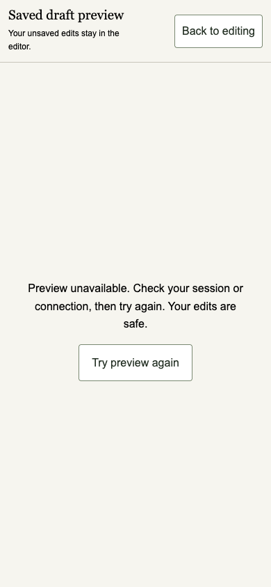 | 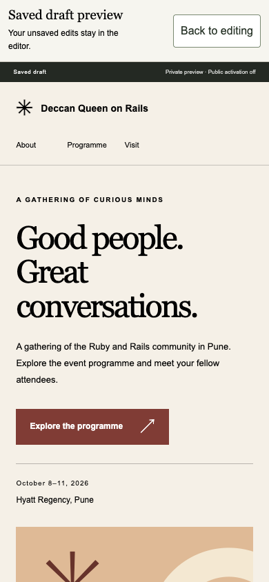 |

6. **Save/publish — healthy within the supported scope.** Existing browser tests cover invalid-order retention, connection failure, Back/Escape, image cancellation, unsaved-publication protection and duplicate submissions creating one revision. Pending labels now distinguish saving, publishing and restoring. Public activation stays off.

7. **Create a free-event draft — improved by its owner; limitation remains.** The original form exposed “Slug” and “IANA timezone”. The revised full-page capture uses URL/display-timezone labels, a three-step sequence, an exact India/UTC example, and visible Create/Back controls. UTC entry still requires conversion; local-time parsing is a separate functional increment.

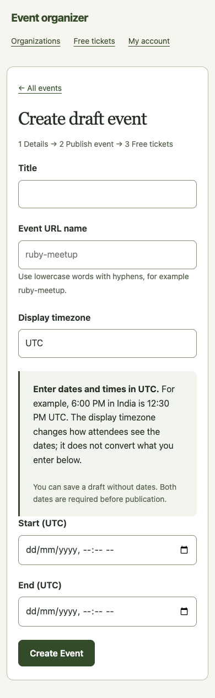

8. **Retrieve a free ticket — healthy in supplied evidence.** The full phone capture includes event, attendee, ticket number, timezone, entry instructions and explicit no-email guidance. The owner reports its create/publish/register/retrieve/check-in browser journey passes.

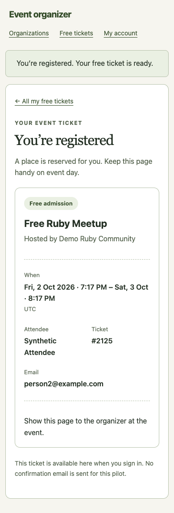

[Desktop ticket](audit-2026-10-02/free-pilot-ticket.png)

9. **Check in — healthy in supplied evidence.** The attendee card presents identity before the large action. Success changes both count and text badge. No native API or meal/party functionality is implied.

| Before confirmation | Committed result |
| --- | --- |
| 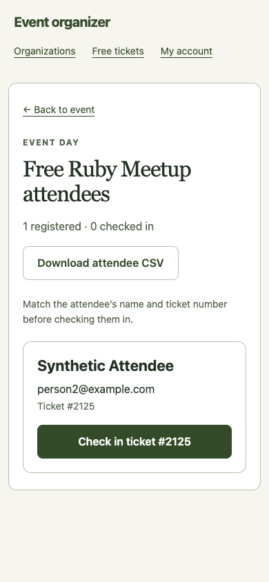 | 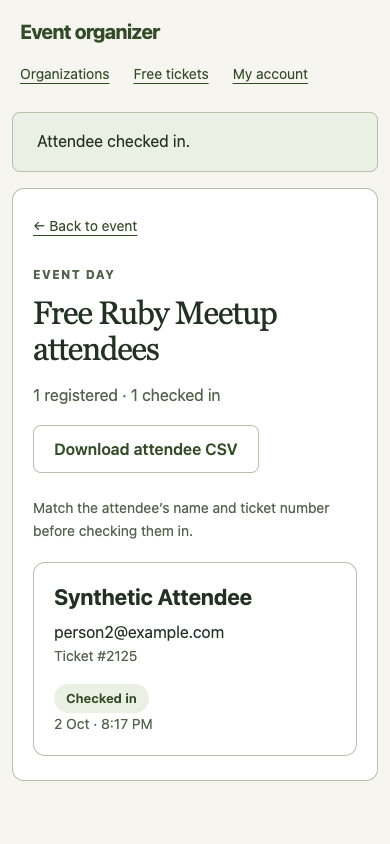 |

## Separate release finding and limits

The local browser's Cache API contained `/organizer/branding` with `Cache-Control: private, no-store`. The shared service worker caches navigation and image responses without honoring those headers. This is same-browser stale/private-data persistence, not evidence of public internet access. Foundation reports this fixed in PR169 at `7dd1b27`: static allowlist only, no navigation HTML caching, private/no-store/no-cache and redirect exclusions, stale-entry removal, and old DQOR cache invalidation. Its browser worker regression and full suite reportedly pass (716 examples). This branch does not edit the worker. Review the final integrated head and release/update lifecycle before rollout; existing production workers are not changed by a PR.

Screenshots do not establish full accessibility compliance. VoiceOver/TalkBack, physical-device gestures, dynamic text and screen-reader announcement order still need platform verification. Native owners received the shared spec; Android confirmed its constraints. This review did not execute their apps. New organization, inventory-publication and foundation error-state screenshots were not supplied, so those intermediate screens are not independently visually audited here.

Implementation and token contract: [visual/interaction spec](VISUAL_INTERACTION_SPEC.md). Screenshot provenance and hashes: [manifest](audit-2026-10-02/MANIFEST.txt).
